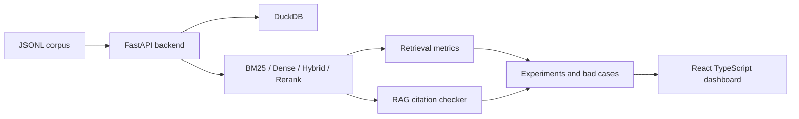

# IR / RAG Evaluation Lab

IR / RAG Evaluation Lab 是一個資訊檢索與 RAG 評估工具箱。它提供 BM25、dense retrieval、hybrid search、cross-encoder reranker、query expansion、retrieval metrics、citation coverage、RAG faithfulness checklist 與 bad case analysis，用來證明我不只是會把 embedding 丟進 vector DB，而是真的懂搜尋評估。

## Project Overview

This repository is a benchmark and evaluation lab, not a chatbot UI. It standardizes corpus/query formats, runs lexical and semantic retrieval baselines, computes IR metrics, checks RAG citations, and surfaces bad cases through a bilingual React dashboard.

## Why BM25 Baseline Matters

BM25 is deterministic, cheap, explainable, and hard to beat on exact-match or entity-heavy corpora. A dense-only demo can hide tokenization, relevance-label, and evaluation problems; a BM25 baseline makes the retrieval quality claim falsifiable.

## Why Retrieval Evaluation Matters

RAG quality depends on whether the right evidence was retrieved before generation. This lab separates retrieval quality from answer style by measuring Recall@K, nDCG@K, MRR, MAP, latency, zero-result rate, citation coverage, and answer support.

## Supported Corpus Format

`documents.jsonl`:

```json
{"doc_id":"doc_001","title":"Document title","text":"Document body or allowed sample text","metadata":{"source":"sample","year":2025,"category":"demo"}}
```

`queries.jsonl`:

```json
{"query_id":"q_001","query":"sample query","relevant_doc_ids":["doc_001","doc_003"]}
```

The repo includes only redistributable sample data. BEIR, MS MARCO, and OpenAlex should be rebuilt through official loaders or documented download steps. Do not commit restricted raw corpora, private documents, generated database files, or model artifacts.

## Architecture



## Retrieval Pipeline

1. Load `documents.jsonl` and `queries.jsonl`.
2. Build BM25 and deterministic dense indexes.
3. Run BM25, dense, hybrid, or rerank search.
4. Store experiment metrics in DuckDB.
5. Persist per-query metrics for Recall@K, nDCG@K, MRR contribution, latency, first relevant rank, difficulty label, and bad case type.
6. Review metric comparisons, score breakdowns, analytics charts, and bad cases in the UI.

## RAG Evaluation Design

The RAG evaluator generates a simple grounded answer from retrieved evidence, records cited document ids, computes citation coverage and answer support rate, and exposes a faithfulness checklist. Unsupported claim notes are intentionally manual-friendly; this lab does not pretend a placeholder is a complete LLM judge.

## Metrics Definitions

- Precision@K: fraction of top-K retrieved documents that are relevant.
- Recall@K: fraction of all relevant documents found in top-K.
- MRR: reciprocal rank of the first relevant result, averaged across queries.
- MAP: average precision across all relevant hits and queries.
- nDCG@K: position-aware ranking quality normalized by the ideal ranking.
- Latency: query execution time in milliseconds.
- Zero-result rate: fraction of queries returning no results.
- Citation coverage: fraction of retrieved evidence documents cited by an answer.
- Answer support rate: fraction of answer support covered by cited evidence.

## Bad Case Taxonomy

`no_relevant_documents_retrieved`, `relevant_document_ranked_too_low`, `lexical_only_failure`, `semantic_only_failure`, `hybrid_disagreement`, `zero_result`, and `high_latency`.

## Backend API Endpoints

All endpoints use `/api/v1`.

- `GET /health`
- `GET /corpus/overview`, `/corpus/documents`, `/corpus/documents/{doc_id}`, `/corpus/queries`, `/corpus/queries/{query_id}`
- `POST /corpus/sample`
- `POST /search`
- `POST /evaluate`
- `GET /analytics/overview`, `/analytics/query-metrics`, `/analytics/dataset-profile`, `/analytics/report-data`
- `GET /experiments`, `/experiments/{experiment_id}`, `/experiments/{experiment_id}/metrics`, `/experiments/compare?ids=`
- `GET /bad-cases`, `/bad-cases/{case_id}`
- `POST /rag/answer`, `POST /rag/evaluate`, `GET /rag/citation-coverage`
- `GET /metrics/definitions`

## React Frontend Page Map

- 總覽 / Overview
- 語料庫 / Corpus
- 查詢評估器 / Query Evaluator
- 檢索比較 / Retrieval Comparison
- RAG 引用檢查 / RAG Citation Checker
- 錯誤案例 / Bad Cases
- 實驗紀錄 / Experiment Runs
- 評估分析 / Evaluation Analytics
- 指標詞彙表 / Metric Glossary

## Bilingual UI Design

The default locale is `zh-TW`; `en-US` is available through the header language switcher. UI strings live in locale JSON files, and the selected language is persisted in `localStorage`.

## Example Experiment

```bash
make install
make sample-data
make index
make evaluate
make report
make api
make frontend
```

`make report` writes Markdown and HTML reports under `data/reports`. The report includes dataset cards, quality checks, metric tables, query difficulty, bad case distribution, dataset profiling buckets, failed queries, citation support notes, and reproducibility metadata.

Dataset conversion examples:

```bash
make load-beir INPUT=data/raw/beir/scifact OUTPUT=data/processed/beir/scifact LIMIT_DOCS=1000 LIMIT_QUERIES=100
make load-msmarco INPUT=data/raw/msmarco OUTPUT=data/processed/msmarco/sample LIMIT_DOCS=1000 LIMIT_QUERIES=100
make load-openalex INPUT=data/raw/openalex/works.jsonl OUTPUT=data/processed/openalex/sample LIMIT_DOCS=1000
```

Dataset-aware ingestion examples:

```bash
make sample-data
make ingest-beir INPUT=data/raw/beir/scifact NAME=scifact VERSION=beir LICENSE=cc-by LIMIT_DOCS=10000 LIMIT_QUERIES=1000
make ingest-msmarco INPUT=data/raw/msmarco NAME=msmarco-passage VERSION=v1 LICENSE=ms-marco LIMIT_DOCS=100000 LIMIT_QUERIES=1000
make ingest-openalex INPUT=data/raw/openalex/works.jsonl.gz NAME=openalex-works VERSION=2026-06 LICENSE=cc0 LIMIT_DOCS=100000
make evaluate DATASET_ID=sample_ir_demo_100
```

The frontend top toolbar includes a dataset selector. Corpus, search, RAG, and evaluation views use the selected dataset id.

Asynchronous job workflow:

```bash
make ingest-beir-job INPUT=data/raw/beir/scifact NAME=scifact PRESET=scifact
make evaluate-batch DATASET_ID=sample_ir_demo_100
```

Job APIs support progress, phase, logs, cancel, and retry:

- `GET /api/v1/jobs`
- `GET /api/v1/jobs/{job_id}`
- `GET /api/v1/jobs/{job_id}/logs`
- `POST /api/v1/jobs/{job_id}/cancel`
- `POST /api/v1/jobs/{job_id}/retry`

Dense retrieval defaults to `IR_RAG_DENSE_BACKEND=auto`: it tries `sentence-transformers/all-MiniLM-L6-v2` and falls back to deterministic mock embeddings if the package or model is unavailable. For real model mode install `pip install -e "backend[dense]"`; for fully offline mode set `IR_RAG_DENSE_BACKEND=mock`.

Open the frontend at `http://127.0.0.1:5173` and the FastAPI docs at `http://127.0.0.1:8000/docs`.

## How This Supports Amazon / OpenAlex / Legal RAG Projects

- Amazon-style search: compare lexical, semantic, and hybrid retrieval on product-like metadata and long-tail queries.
- OpenAlex: evaluate scholarly metadata retrieval by title, concepts, institutions, venues, and citation context.
- Legal RAG: inspect citation coverage, missing authority, faithful answers, and high-risk bad cases.

## Limitations

This is a compact professional lab. Dense retrieval can use sentence-transformers but keeps deterministic mock fallback for offline reproducibility. Reranking and query expansion expose interfaces with placeholder scoring rather than claiming a production cross-encoder or LLM pipeline.

## Resume Bullets

中文：

- 建立 FastAPI + DuckDB 的 IR/RAG 評估平台，支援 BM25、dense、hybrid、rerank 與實驗比較。
- 實作 Precision@K、Recall@K、MRR、MAP、nDCG@K、zero-result rate、citation coverage 與 bad case analysis。
- 開發 React TypeScript 雙語儀表板，支援繁中/英文、查詢評估、RAG 引用檢查與檢索比較視覺化。

English:

- Built a FastAPI and DuckDB IR/RAG evaluation lab with BM25, dense, hybrid, rerank, and experiment comparison workflows.
- Implemented retrieval metrics, citation coverage, faithfulness checklist, and bad case taxonomy for evidence-grounded RAG evaluation.
- Delivered a bilingual React TypeScript dashboard for query evaluation, retrieval comparison, RAG citation review, and metric glossary.
