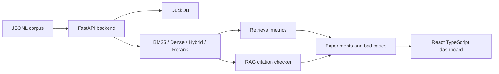

# IR / RAG Evaluation Lab

IR / RAG Evaluation Lab 是一個資訊檢索與 RAG 評估工具箱。它提供 BM25、dense retrieval、hybrid search、cross-encoder reranker、query expansion、retrieval metrics、citation coverage、RAG faithfulness checklist 與 bad case analysis，用來證明我不只是會把 embedding 丟進 vector DB，而是真的懂搜尋評估。

## Project Overview

This repository is a benchmark and evaluation lab, not a chatbot UI. It standardizes corpus/query formats, runs lexical and semantic retrieval baselines, computes IR metrics, checks RAG citations, and surfaces bad cases through a bilingual React dashboard.
It can optionally connect to a local llama.cpp OpenAI-compatible server for assistive evaluation signals such as bad case suggestions, query rewrites, claim faithfulness judgments, and experiment analyst notes. It also includes deterministic text-mining analytics for co-occurrence, collocation, network analysis, basket analysis, and Sankey-style corpus-to-failure flows.

## Demo Evidence

- Live demo: <https://neojustin.dothost.net/projects/ir-rag-evaluation-lab/>
- Demo recording: [`docs/demo/ir-rag-evaluation-lab-demo.mp4`](docs/demo/ir-rag-evaluation-lab-demo.mp4)
- Screenshot walkthrough: [`docs/demo/screenshots/`](docs/demo/screenshots/)
- Playwright verification: `cd frontend && npm run capture:demo`

The Playwright walkthrough verifies the auto-start guided assistant, all guided tour targets, the Pipeline Journey, dataset/corpus management, query evaluation, retrieval comparison, analytics drill-downs, RAG citation checking, bad case review, LLM evaluation, text-mining network analysis, experiment runs, and zh-TW/en-US switching.

Representative captures:

| Area | Screenshot |
| --- | --- |
| Guided assistant | [`01-tour-overview.png`](docs/demo/screenshots/01-tour-overview.png) |
| Pipeline Journey | [`16-journey-top.png`](docs/demo/screenshots/16-journey-top.png) |
| Query Evaluator | [`20-query-evaluator-results.png`](docs/demo/screenshots/20-query-evaluator-results.png) |
| Evaluation Analytics | [`22-analytics-top.png`](docs/demo/screenshots/22-analytics-top.png) |
| RAG Citation Workbench | [`24-rag-citation-workbench.png`](docs/demo/screenshots/24-rag-citation-workbench.png) |
| Text Mining Network | [`27-text-mining-network.png`](docs/demo/screenshots/27-text-mining-network.png) |
| English UI | [`29-english-ui.png`](docs/demo/screenshots/29-english-ui.png) |

## Why BM25 Baseline Matters

BM25 is deterministic, cheap, explainable, and hard to beat on exact-match or entity-heavy corpora. A dense-only demo can hide tokenization, relevance-label, and evaluation problems; a BM25 baseline makes the retrieval quality claim falsifiable.

## Why Retrieval Evaluation Matters

RAG quality depends on whether the right evidence was retrieved before generation. This lab separates retrieval quality from answer style by measuring Recall@K, nDCG@K, MRR, MAP, latency, zero-result rate, citation coverage, and answer support.

## Supported Corpus Format

`documents.jsonl`:

```json
{"doc_id":"doc_001","title":"Document title","text":"Document body or allowed sample text","metadata":{"source":"sample","year":2025,"category":"demo"}}
```

`queries.jsonl`:

```json
{"query_id":"q_001","query":"sample query","relevant_doc_ids":["doc_001","doc_003"]}
```

The repo includes only redistributable sample data. BEIR, MS MARCO, and OpenAlex should be rebuilt through official loaders or documented download steps. Do not commit restricted raw corpora, private documents, generated database files, or model artifacts.

## Architecture



## Retrieval Pipeline

1. Load `documents.jsonl` and `queries.jsonl`.
2. Build BM25 and deterministic dense indexes.
3. Run BM25, dense, hybrid, or rerank search.
4. Store experiment metrics in DuckDB.
5. Persist per-query metrics for Recall@K, nDCG@K, MRR contribution, latency, first relevant rank, difficulty label, and bad case type.
6. Use diagnostics, pairwise comparison, correlation charts, deterministic insights, and bad case root cause review to decide which retriever is worth improving.
7. Run text-mining analytics to inspect term communities, co-occurrence networks, collocations, association rules, and links between corpus metadata, query difficulty, and failure causes.

## RAG Evaluation Design

The RAG evaluator generates a simple grounded answer from retrieved evidence, records cited document ids, computes citation coverage and answer support rate, and exposes a faithfulness checklist. Unsupported claim notes are intentionally manual-friendly. When llama.cpp is configured, the local judge adds assistive claim-level labels, rationale, confidence, and evidence ids, then persists the run history in DuckDB for audit and dashboard views.

## Metrics Definitions

- Precision@K: fraction of top-K retrieved documents that are relevant.
- Recall@K: fraction of all relevant documents found in top-K.
- MRR: reciprocal rank of the first relevant result, averaged across queries.
- MAP: average precision across all relevant hits and queries.
- nDCG@K: position-aware ranking quality normalized by the ideal ranking.
- Latency: query execution time in milliseconds.
- Zero-result rate: fraction of queries returning no results.
- Citation coverage: fraction of retrieved evidence documents cited by an answer.
- Answer support rate: fraction of answer support covered by cited evidence.

## Bad Case Taxonomy

`no_relevant_documents_retrieved`, `relevant_document_ranked_too_low`, `lexical_only_failure`, `semantic_only_failure`, `hybrid_disagreement`, `zero_result`, and `high_latency`.

## Backend API Endpoints

All endpoints use `/api/v1`.

- `GET /health`
- `GET /corpus/overview`, `/corpus/documents`, `/corpus/documents/{doc_id}`, `/corpus/queries`, `/corpus/queries/{query_id}`
- `POST /corpus/sample`
- `POST /search`
- `POST /evaluate`
- `GET /analytics/overview`, `/analytics/query-metrics`, `/analytics/dataset-profile`, `/analytics/report-data`
- `GET /analytics/query-diagnostics`, `/analytics/pairwise`, `/analytics/correlations`, `/analytics/insights`
- `GET /analytics/metric-matrix`, `/analytics/failure-heatmap`, `/analytics/rank-movement`, `/analytics/retriever-battle`
- `POST /text-mining/run`
- `GET /text-mining/summary`, `/text-mining/terms`, `/text-mining/cooccurrence`, `/text-mining/collocations`, `/text-mining/network`, `/text-mining/association-rules`, `/text-mining/sankey`
- `GET /llm/status`, `/llm/dashboard`, `/llm/runs`, `/llm/runs/{run_id}`
- `POST /llm/query-rewrite`, `/llm/query-rewrite-experiment`, `/llm/rag-faithfulness`, `/llm/bad-case-suggestion`, `/llm/evaluate-suite`, `/llm/experiment-narrative`
- `GET /evaluation-suites`, `/evaluation-suites/{suite_id}`, `POST /evaluation-suites/run`
- `GET /experiments`, `/experiments/{experiment_id}`, `/experiments/{experiment_id}/metrics`, `/experiments/compare?ids=`
- `GET /bad-cases`, `/bad-cases/{case_id}`
- `POST /rag/answer`, `POST /rag/evaluate`, `GET /rag/citation-coverage`
- `GET /metrics/definitions`

## React Frontend Page Map

- 總覽 / Overview
- 語料庫 / Corpus
- 查詢評估器 / Query Evaluator
- 檢索比較 / Retrieval Comparison
- RAG 引用檢查 / RAG Citation Checker
- LLM 評估 / LLM Evaluation
- 文本探勘 / Text Mining
- 錯誤案例 / Bad Cases
- 實驗紀錄 / Experiment Runs
- 評估分析 / Evaluation Analytics
- 指標詞彙表 / Metric Glossary

## Bilingual UI Design

The default locale is `zh-TW`; `en-US` is available through the header language switcher. UI strings live in locale JSON files, and the selected language is persisted in `localStorage`.

## Example Experiment

```bash
make install
make refresh-lab
make text-mining DATASET_ID=sample_ir_demo_100
make api
make frontend
```

`make refresh-lab` is the reproducible end-to-end path. It regenerates the benchmark sample pack, runs BM25/dense/hybrid/rerank suites for `sample_ir_demo_100`, `sample_legal_rag_50`, `sample_openalex_100`, and `sample_ecommerce_search_100`, calls the local llama.cpp judge in strict mode, runs text-mining analytics, and writes reports.

`make report` writes Markdown and HTML reports under `data/reports`. The HTML report is a dashboard artifact with ECharts metric matrix, failure heatmap, retriever battle chart, rank movement, LLM judge statistics, text-mining Sankey, co-occurrence network, association rules, and fallback tables.
It also includes deterministic insight summaries, dense-vs-BM25 wins, bad case root cause distribution, severity, and review status.

Dataset conversion examples:

```bash
make load-beir INPUT=data/raw/beir/scifact OUTPUT=data/processed/beir/scifact LIMIT_DOCS=1000 LIMIT_QUERIES=100
make load-msmarco INPUT=data/raw/msmarco OUTPUT=data/processed/msmarco/sample LIMIT_DOCS=1000 LIMIT_QUERIES=100
make load-openalex INPUT=data/raw/openalex/works.jsonl OUTPUT=data/processed/openalex/sample LIMIT_DOCS=1000
```

Dataset-aware ingestion examples:

```bash
make sample-data
make ingest-beir INPUT=data/raw/beir/scifact NAME=scifact VERSION=beir LICENSE=cc-by LIMIT_DOCS=10000 LIMIT_QUERIES=1000
make ingest-msmarco INPUT=data/raw/msmarco NAME=msmarco-passage VERSION=v1 LICENSE=ms-marco LIMIT_DOCS=100000 LIMIT_QUERIES=1000
make ingest-openalex INPUT=data/raw/openalex/works.jsonl.gz NAME=openalex-works VERSION=2026-06 LICENSE=cc0 LIMIT_DOCS=100000
make evaluate DATASET_ID=sample_ir_demo_100
```

The frontend top toolbar includes a dataset selector. Corpus, search, RAG, and evaluation views use the selected dataset id.

Asynchronous job workflow:

```bash
make ingest-beir-job INPUT=data/raw/beir/scifact NAME=scifact PRESET=scifact
make evaluate-batch DATASET_ID=sample_ir_demo_100
```

Job APIs support progress, phase, logs, cancel, and retry:

- `GET /api/v1/jobs`
- `GET /api/v1/jobs/{job_id}`
- `GET /api/v1/jobs/{job_id}/logs`
- `POST /api/v1/jobs/{job_id}/cancel`
- `POST /api/v1/jobs/{job_id}/retry`

Dense retrieval defaults to `IR_RAG_DENSE_BACKEND=auto`: it tries `sentence-transformers/all-MiniLM-L6-v2` and falls back to deterministic mock embeddings if the package or model is unavailable. For real model mode install `pip install -e "backend[dense]"`; for fully offline mode set `IR_RAG_DENSE_BACKEND=mock`.

Local llama.cpp integration is optional. Start a llama.cpp OpenAI-compatible server, then set:

```bash
export IR_RAG_LLM_BASE_URL=http://127.0.0.1:8080/v1
export IR_RAG_LLM_MODEL=your-local-model
```

LLM-assisted results are always labeled as assistive signals, not ground truth. Normal interactive endpoints can still use deterministic fallback for offline demos and tests. Strict runs, including `make refresh-lab`, `make llm-evaluate`, and requests with `require_real_llm=true`, fail if llama.cpp is disconnected or returns invalid JSON.

LLM run history is persisted in DuckDB:

- `llm_runs`: prompt type, provider, model, status, latency, confidence, summarized input/output, request/response debug payload.
- `llm_judgments`: bad case and RAG claim judgments with confidence, rationale, evidence ids, and review status.
- `llm_rewrite_runs`: original vs rewrite strategy metrics, Recall/nDCG deltas, and rank deltas.

The LLM Evaluation page visualizes claim judgment distribution, root cause distribution, confidence histogram, latency trend, rewrite improvement, real/fallback/failed run mix, prompt-type latency, judgment-by-retriever, slowest prompts, and recent run history. The Query Evaluator can run rewrite experiments across many queries to show whether lexical, semantic, entity-focused, or domain-specific rewrites actually improve Recall@K. Raw JSON is kept in debug details rather than being the primary UI.

Evaluation Analytics defaults to the latest completed experiment for each retriever on the selected dataset. A suite selector can lock all charts, tables, diagnostics, and correlations to one reproducible batch so metrics are not polluted by old historical runs. The page now includes metric matrix heatmaps, query failure heatmaps, first-relevant-rank movement across retrievers, pairwise retriever battle summaries, correlation/tradeoff charts, and click-through query diagnostics with persisted LLM diagnosis when available.

Text Mining uses deterministic token/ngram statistics by default, with optional `backend[textmining]` extras documented for heavier workflows. The default implementation avoids model downloads while still producing co-occurrence networks, PMI collocations, term communities, association rules, and corpus-to-failure Sankey flows.

Open the frontend at `http://127.0.0.1:5173` and the FastAPI docs at `http://127.0.0.1:8000/docs`.

## How This Supports Amazon / OpenAlex / Legal RAG Projects

- Amazon-style search: compare lexical, semantic, and hybrid retrieval on product-like metadata and long-tail queries.
- OpenAlex: evaluate scholarly metadata retrieval by title, concepts, institutions, venues, and citation context.
- Legal RAG: inspect citation coverage, missing authority, faithful answers, and high-risk bad cases.

## Limitations

This is a compact professional lab. Dense retrieval can use sentence-transformers but keeps deterministic mock fallback for offline reproducibility. Reranking and query expansion expose interfaces with placeholder scoring rather than claiming a production cross-encoder or LLM pipeline.

## Resume Bullets

中文：

- 建立 FastAPI + DuckDB 的 IR/RAG 評估平台，支援 BM25、dense、hybrid、rerank 與實驗比較。
- 實作 Precision@K、Recall@K、MRR、MAP、nDCG@K、zero-result rate、citation coverage 與 bad case analysis。
- 開發 React TypeScript 雙語儀表板，支援繁中/英文、查詢評估、RAG 引用檢查與檢索比較視覺化。

English:

- Built a FastAPI and DuckDB IR/RAG evaluation lab with BM25, dense, hybrid, rerank, and experiment comparison workflows.
- Implemented retrieval metrics, citation coverage, faithfulness checklist, and bad case taxonomy for evidence-grounded RAG evaluation.
- Delivered a bilingual React TypeScript dashboard for query evaluation, retrieval comparison, RAG citation review, and metric glossary.
