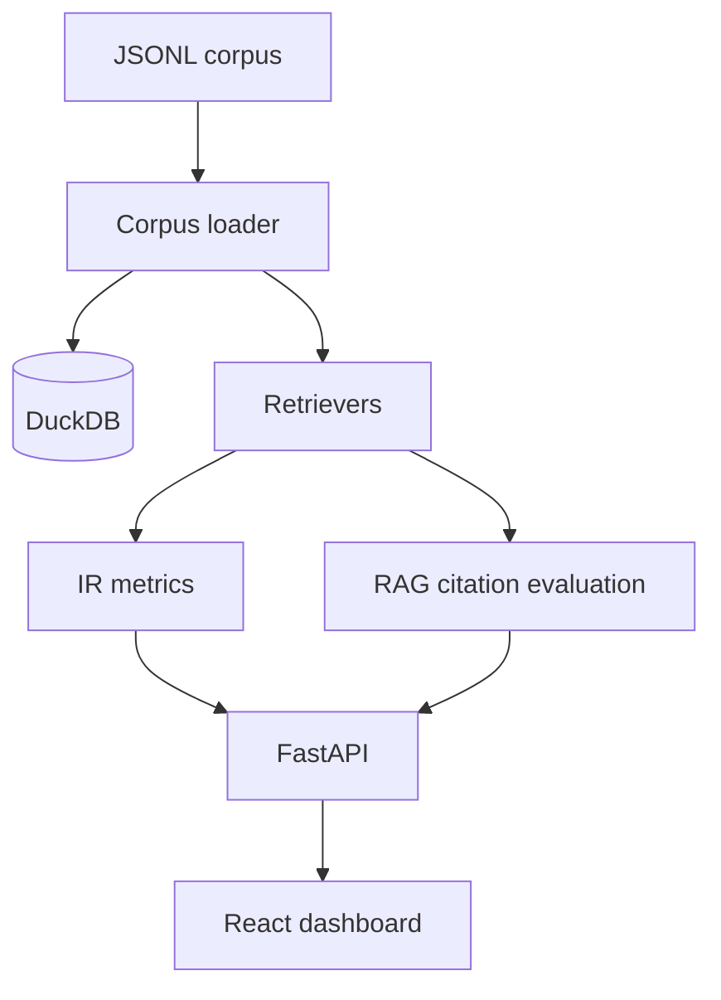

# Architecture

The system is a frontend/backend monorepo. FastAPI exposes evaluation APIs, DuckDB stores corpus metadata and experiment outputs, retrievers implement BM25/dense/hybrid/rerank interfaces, and React renders a bilingual dashboard.

